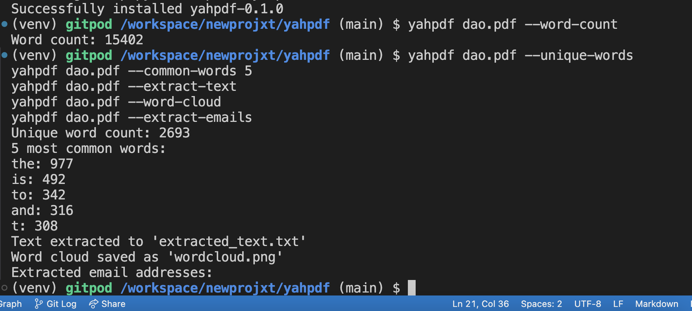

```
(main) $ pip install -e .

Obtaining file:///workspace/newprojxt/yahpdf
  Preparing metadata (setup.py) ... done
Requirement already satisfied: PyPDF2 in /workspace/newprojxt/pdf-cli-tool/venv/lib/python3.12/site-packages (from yahpdf==0.1.0) (3.0.1)
Requirement already satisfied: matplotlib in /workspace/newprojxt/pdf-cli-tool/venv/lib/python3.12/site-packages (from yahpdf==0.1.0) (3.9.2)
Requirement already satisfied: wordcloud in /workspace/newprojxt/pdf-cli-tool/venv/lib/python3.12/site-packages (from yahpdf==0.1.0) (1.9.3)
Requirement already satisfied: contourpy>=1.0.1 in /workspace/newprojxt/pdf-cli-tool/venv/lib/python3.12/site-packages (from matplotlib->yahpdf==0.1.0) (1.3.0)
Requirement already satisfied: cycler>=0.10 in /workspace/newprojxt/pdf-cli-tool/venv/lib/python3.12/site-packages (from matplotlib->yahpdf==0.1.0) (0.12.1)
Requirement already satisfied: fonttools>=4.22.0 in /workspace/newprojxt/pdf-cli-tool/venv/lib/python3.12/site-packages (from matplotlib->yahpdf==0.1.0) (4.53.1)
Requirement already satisfied: kiwisolver>=1.3.1 in /workspace/newprojxt/pdf-cli-tool/venv/lib/python3.12/site-packages (from matplotlib->yahpdf==0.1.0) (1.4.7)
Requirement already satisfied: numpy>=1.23 in /workspace/newprojxt/pdf-cli-tool/venv/lib/python3.12/site-packages (from matplotlib->yahpdf==0.1.0) (2.1.1)
Requirement already satisfied: packaging>=20.0 in /workspace/newprojxt/pdf-cli-tool/venv/lib/python3.12/site-packages (from matplotlib->yahpdf==0.1.0) (24.1)
Requirement already satisfied: pillow>=8 in /workspace/newprojxt/pdf-cli-tool/venv/lib/python3.12/site-packages (from matplotlib->yahpdf==0.1.0) (10.4.0)
Requirement already satisfied: pyparsing>=2.3.1 in /workspace/newprojxt/pdf-cli-tool/venv/lib/python3.12/site-packages (from matplotlib->yahpdf==0.1.0) (3.1.4)
Requirement already satisfied: python-dateutil>=2.7 in /workspace/newprojxt/pdf-cli-tool/venv/lib/python3.12/site-packages (from matplotlib->yahpdf==0.1.0) (2.9.0.post0)
Requirement already satisfied: six>=1.5 in /workspace/newprojxt/pdf-cli-tool/venv/lib/python3.12/site-packages (from python-dateutil>=2.7->matplotlib->yahpdf==0.1.0) (1.16.0)
Installing collected packages: yahpdf
  DEPRECATION: Legacy editable install of yahpdf==0.1.0 from file:///workspace/newprojxt/yahpdf (setup.py develop) is deprecated. pip 25.0 will enforce this behaviour change. A possible replacement is to add a pyproject.toml or enable --use-pep517, and use setuptools >= 64. If the resulting installation is not behaving as expected, try using --config-settings editable_mode=compat. Please consult the setuptools documentation for more information. Discussion can be found at https://github.com/pypa/pip/issues/11457
  Running setup.py develop for yahpdf
Successfully installed yahpdf-0.1.0
(venv) gitpod /workspace/newprojxt/yahpdf (main) $ 
```